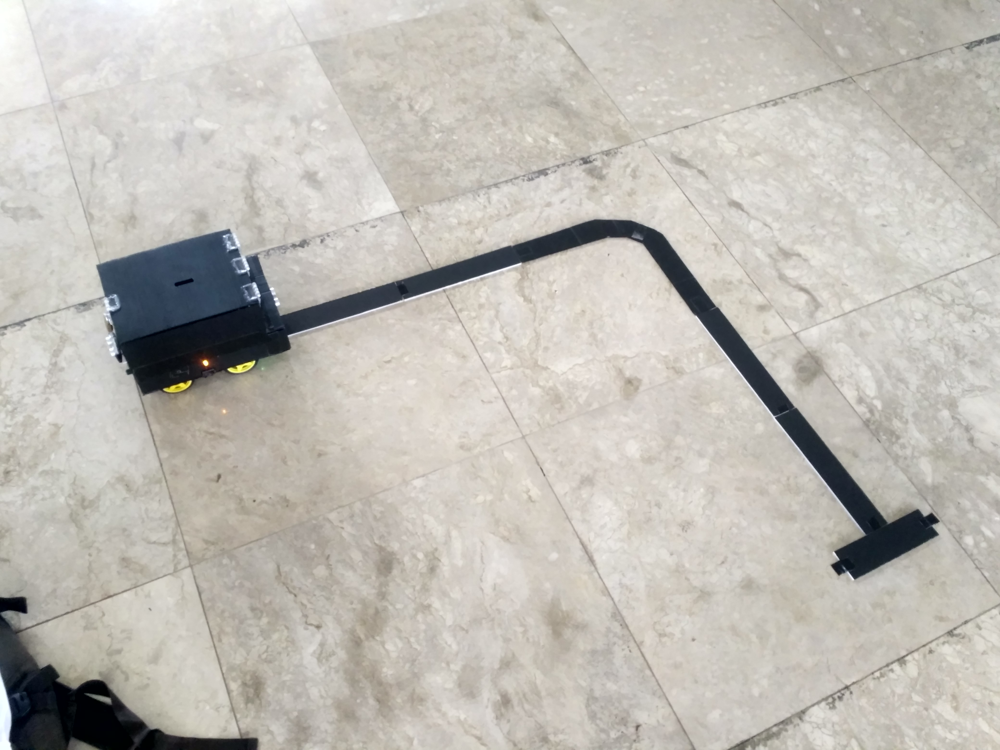

# Kotak Amal Berjalan Otomatis

### Ringkasan

Proyek ini bertujuan untuk membuat kotak amal yang dapat berjalan secara otomatis. Proyek ini juga dimaksudkan untuk memenuhi syarat mencapai gelar Sarjana Sains pada jurusan Fisika, Fakultas Sains dan Teknologi Universitas Islam Negeri Syarif Hidayatullah Jakarta.

    
    
    

### Fitur

1. Kotak amal dapat bergerak secara otomatis mengikuti jalur garis (hitam/putih) yang telah dibuat
2. Letakkan tangan di depan untuk stop, lalu letakkan tangan di belakang untuk kembali bergerak
3. Dapat menampung beban sekitar 1,5 kg
4. Baterai dapat diisi ulang dengan menggunakan adaptor 12 Volt

### Arduino Library Yang Digunakan

1. `AFMotor.h` oleh [Adafruit](https://github.com/adafruit/Adafruit-Motor-Shield-library)
2. `NewPing.h` oleh [Tim Eckel](https://bitbucket.org/teckel12/arduino-new-ping/wiki/Home)

### Komponen Yang Digunakan

1. Arduino Mega 2560
2. Motor Driver Shield L293D
3. 2 buah Sensor Ultrasonik HC-SR04
4. 2 buah Sensor Garis TCRT5000
5. 2 buah LED Kuning disertai resistor 220 ohm
6. 4 buah DC Motor
7. 3 buah Baterai 18650
8. Battery Management System (BMS) 3S 20A
9. Buck Converter MP2307
10. Saklar
11. Jack DC Female

### Wiring Diagram

<h3>Demonstrasi</h3>

https://github.com/mcgalih/Charity-Box-Car/assets/59424448/adcf0c62-4023-4c0e-915a-544db8705192
